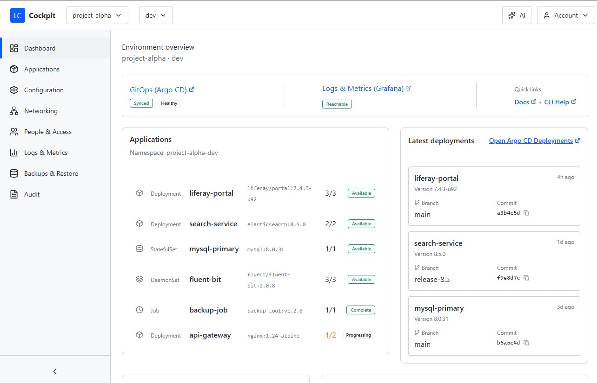

# Kubernetes Based PaaS

A GitOps-first, Kubernetes-native Platform-as-a-Service (PaaS) specialized for Liferay DXP environments. This project, also known as **Liferay Cloud 2.0 (LC2)** or **Liferay Cockpit**, provides a multi-tenant platform that enforces strict isolation and standardizes DevOps workflows across local and cloud Kubernetes deployments.

## Overview

LC2 treats Git as the source of truth and uses Argo CD to reconcile desired state into Kubernetes. The Cockpit management interface (Java + Next.js) enables project Owners and Members to operate their environments without requiring direct kubectl access.

### Key Features

- **GitOps-first workflow** - All configuration and policy changes flow through Pull Requests
- **Hard multi-tenant isolation** - Each project is a tenant with dedicated namespaces per environment (dev/uat/prd)
- **Cloud + Local parity** - Same workflows operate locally and on EKS/AKS
- **Managed services integration** - Leverages RDS/Azure PostgreSQL, S3/Blob storage, and managed observability platforms
- **Kubernetes stateless by default** - Primary durable data lives outside the cluster on managed services
- **Compliance-ready** - Immutable audit trail through PR history and platform audit logs

### Core Capabilities

- **Isolation** - Strict project/environment boundaries enforced by namespace policies, RBAC, quotas, and admission control
- **DevOps workflow** - PR-driven deployments with promotion pipeline (dev → uat → prd) and verification gates
- **Observability** - Deep-links to managed Grafana for metrics and alerts
- **Logs** - CLI-first approach for tailing/querying logs via CloudWatch/Log Analytics/Loki
- **Backup & Restore** - Externalized via database PITR, versioned object storage, and search snapshots

## UI Design

The UI from this project can be found here: https://polish-small-67185439.figma.site/

## Philosophy

*GitOps-first • Kubernetes-native • Multi-tenant isolation • KISS • Local↔Cloud parity*

Simple things should be simple; complex things possible. We follow **KISS (Keep It Simple and Straightforward)** and avoid unnecessary complexity.
